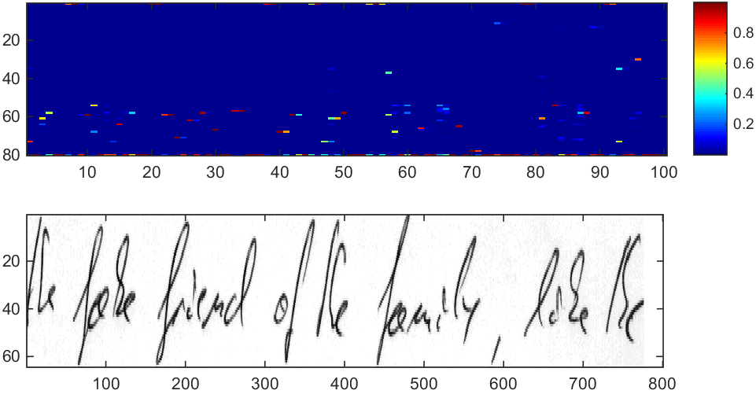
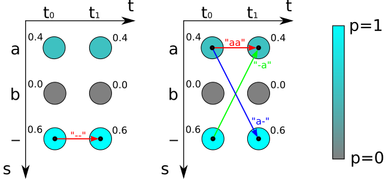

# CTC Decoding Algorithms with Language Model

Connectionist Temporal Classification (CTC) decoding algorithms are implemented as python scripts. A minimalistic Language Model (LM) is used.

## Algorithms
- Best Path Decoding: takes best label per time-step, then removes repeated labels and blanks from this path. File: `BestPath.py` \[1]
- Prefix Search Decoding: best-first search through tree of labellings. File: `PrefixSearch.py` \[1]
- Beam Search Decoding: iteratively searches for best labelling, uses a character-level LM. File: `BeamSearch.py` \[2]
- Token Passing: searches for most probable word sequence, words are restricted to the words from a dictionary. Can be extended to use a word-level LM. File: `TokenPassing.py` \[1]

## Run
```python main.py```

Expected results:
```
=====Mini example=====                                   
TARGET       : "a"                                       
BEST PATH    : ""                                        
PREFIX SEARCH: "a"                                       
BEAM SEARCH  : "a"                                       
TOKEN        : "a"                                       
=====Real example=====                                   
TARGET        : "the fake friend of the family, like the"
BEST PATH     : "the fak friend of the fomly hae tC"     
PREFIX SEARCH : "the fak friend of the fomcly hae tC"    
BEAM SEARCH   : "the fak friend of the fomcly hae tC"
BEAM SEARCH LM: "the fake friend of the family, fake th"
TOKEN         : "the fake friend of the family fake the" 
```

## Data files
- data/rnnOutput.csv: output of RNN layer (softmax not yet applied), which contains 100 time-steps and 80 label scores per time-step
- data/corpus.txt: the text from which the language model is generated. In this case it is just the scrambled ground-truth text.

## Notes
These python scripts are intended for tests and experiments. 
For productive use I implemented the functions in C++ (for performance reasons) and then added them to TensorFlow as custom ops.

The ground-truth text is "the fake friend of the family, like the" and is a sample from the IAM Handwriting Database \[4]. 
RNN output was generated by a partially trained TensorFlow model which was inspired by CRNN \[3].
The visualisation below shows the input image and the RNN output as a matrix with 100 time-steps and 80 classes (the last one being the blank label). 
Each column sums to 1 and each entry shows the probability of seeing a label at a given time-step.



Illustration of the "Mini example" testcase: the RNN output is a table containing 2 time-steps (t0 and t1) and 3 labels (a, b and - as the special blank label).
Best path decoding takes the most probable label per time-step which gives the path "--" and therefore the recognized text "" with probability 0.6\*0.6=0.36.
Beam and prefix search calculate the probability of labellings. For the labelling "a" it sums over the paths (see thin lines) "-a", "a-" and "aa" with probability 0.4\*0.4+2\*0.6\*0.4=0.64.
The only path (see dashed line) which gives "" still has probability 0.36, therefore "a" is the result returned by beam search.



## Choosing the right algorithm
[This paper](./doc/comparison.pdf) compares beam search decoding and token passing.
It also gives suggestions when to use best path decoding, beam search decoding and token passing.


## References

\[1] Graves - Supervised sequence labelling with recurrent neural networks

\[2] Hwang - Character-level incremental speech recognition with recurrent neural networks

\[3] https://github.com/bgshih/crnn

\[4] http://www.fki.inf.unibe.ch/databases/iam-handwriting-database
