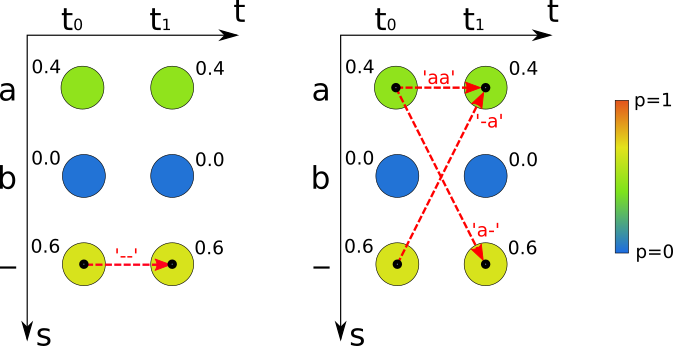
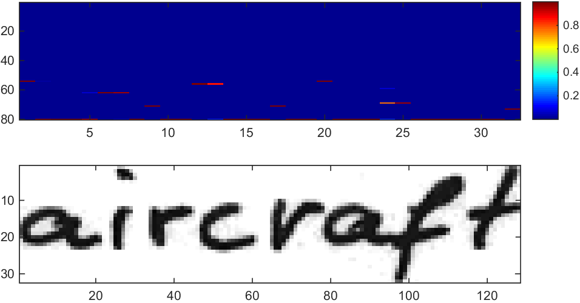

# CTC Decoding Algorithms with Language Model
Connectionist Temporal Classification (CTC) decoding algorithms are implemented as Python scripts. A minimalistic Language Model (LM) is provided.


## Run demo
Go to the `src/` directory and run the script ```python main.py```.
Appending the command line parameter ```gpu``` additionally executes best path decoding on the GPU.

Expected results:
```
=====Mini example=====
TARGET       : "a"
BEST PATH    : ""
PREFIX SEARCH: "a"
BEAM SEARCH  : "a"
TOKEN        : "a"
PROB(TARGET) : 0.64
LOSS(TARGET) : 0.4462871026284195
=====Word example=====
TARGET        : "aircraft"
BEST PATH     : "aircrapt"
LEXICON SEARCH: "aircraft"
=====Line example=====
TARGET        : "the fake friend of the family, like the"
BEST PATH     : "the fak friend of the fomly hae tC"
PREFIX SEARCH : "the fak friend of the fomcly hae tC"
BEAM SEARCH   : "the fak friend of the fomcly hae tC"
BEAM SEARCH LM: "the fake friend of the family, lie th"
TOKEN         : "the fake friend of the family fake the"
PROB(TARGET)  : 6.314726428865645e-13
LOSS(TARGET)  : 28.090721774903226
=====Line example (GPU)=====
BestPathCL.compute(...) time:  0.04680013656616211
Compute for 1000 batch elements
TARGET        : "the fake friend of the family, like the"
BEST PATH GPU : "the fak friend of the fomly hae tC"
```


## Provided algorithms
* Best Path Decoding: takes best label per time-step to compute best path, then removes repeated labels and CTC-blanks from this path. File: `BestPath.py` for CPU implementation and `BestPathCL.py`/`BestPathCL.cl` for GPU implementation \[1\]
* Prefix Search Decoding: best-first search through tree of labelings. File: `PrefixSearch.py` \[1\]
* Beam Search Decoding: iteratively searches for best labeling in a tree of labelings, optionally uses a character-level LM. File: `BeamSearch.py` \[2\] \[5\]
* Token Passing: searches for most probable word sequence. The words are constrained to those contained in a dictionary. Can be extended to use a word-level LM. File: `TokenPassing.py` \[1\]
* Lexicon Search: computes approximation with best path decoding to find similar words in dictionary. Returns the one with highest score. File: `LexiconSearch.py` \[3\]
* Loss: calculates probability and loss of a given text in the RNN output. File: `Loss.py` \[1\] \[6\]
* Word Beam Search: TensorFlow implementation see repository [CTCWordBeamSearch](https://github.com/githubharald/CTCWordBeamSearch) \[8\]


## Choosing the right algorithm
[This paper](./doc/comparison.pdf) \[7\] compares beam search decoding and token passing.
It gives suggestions when to use best path decoding, beam search decoding and token passing.


## Testcases

The RNN output matrix of the **Mini example** testcase contains 2 time-steps (t0 and t1) and 3 labels (a, b and - representing the CTC-blank).
Best path decoding (see left figure) takes the most probable label per time-step which gives the path "--" and therefore the recognized text "" with probability 0.6\*0.6=0.36.
Beam search, prefix search and token passing calculate the probability of labelings. 
For the labeling "a" these algorithms sum over the paths "-a", "a-" and "aa" (see right figure) with probability 0.6\*0.4+0.4\*0.6+0.4*0.4=0.64.
The only path which gives "" still has probability 0.36, therefore "a" is the result returned by beam search, prefix search and token passing.



The **Word example** testcase contains a single word from the IAM Handwriting Database \[4\]. 
It is used to test lexicon search \[3\].
RNN output was generated with the [SimpleHTR](https://github.com/githubharald/SimpleHTR) model (by using the `--dump` option).
Lexicon search first computes an approximation with best path decoding, then searches for similar words in a dictionary using a BK tree, and finally scores them by computing the loss and returning the most probable dictionary word.
Best path decoding outputs "aircrapt", lexicon search is able to find similar words like "aircraft" and "airplane" in the dictionary, calculates a score for each of them and finally returns "aircraft", which is the correct result.
The figure below shows the input image and the RNN output matrix with 32 time-steps and 80 classes (the last one being the CTC-blank).
Each column sums to 1 and each entry represents the probability of seeing a label at a given time-step.




The ground-truth text of the **Line example** testcase is "the fake friend of the family, like the" and is a sample from the IAM Handwriting Database \[4\]. 
This test case is used to test all algorithms except lexicon search.
RNN output was generated by a partially trained TensorFlow model inspired by CRNN \[3\] which essentially is a larger version of the [SimpleHTR](https://github.com/githubharald/SimpleHTR) model.
The figure below shows the input image and the RNN output matrix with 100 time-steps and 80 classes. 


## Data files
The data files for the **Word example** are located in data/word and the files for the **Line example** in data/line.
Each of these directories contains:
* rnnOutput.csv: output of RNN layer (softmax not yet applied), which contains 32 or 100 time-steps and 80 label scores per time-step.
* corpus.txt: the text from which the language model is generated.
* img.png: the input image of the neural network. It is contained as an illustration, however, the decoding algorithms do not use it.


## Notes
The provided Python scripts are intended for tests and experiments. 
For productive use I recommend implementing these algorithms in C++ (for performance reasons).
A C++ implementation can easily be integrated into deeplearning-frameworks such as TensorFlow (see [CTCWordBeamSearch](https://github.com/githubharald/CTCWordBeamSearch) for an example).

A GPU implementation is provided for best path decoding which requires pyopencl installed and executing `python main.py gpu`.


## References

\[1\] [Graves - Supervised sequence labelling with recurrent neural networks](https://www.cs.toronto.edu/~graves/preprint.pdf)

\[2\] [Hwang - Character-level incremental speech recognition with recurrent neural networks](https://arxiv.org/pdf/1601.06581.pdf)

\[3\] [Shi - An End-to-End Trainable Neural Network for Image-based Sequence Recognition and Its Application to Scene Text Recognition](https://arxiv.org/pdf/1507.05717.pdf)

\[4\] [Marti - The IAM-database: an English sentence database for offline handwriting recognition](http://www.fki.inf.unibe.ch/databases/iam-handwriting-database)

\[5\] [Beam Search Decoding in CTC-trained Neural Networks](https://towardsdatascience.com/5a889a3d85a7)

\[6\] [An Intuitive Explanation of Connectionist Temporal Classification](https://towardsdatascience.com/3797e43a86c)

\[7\] [Scheidl - Comparison of Connectionist Temporal Classification Decoding Algorithms](./doc/comparison.pdf)

\[8\] [Scheidl - Word Beam Search: A Connectionist Temporal Classification Decoding Algorithm](https://repositum.tuwien.ac.at/obvutwoa/download/pdf/2774578)
